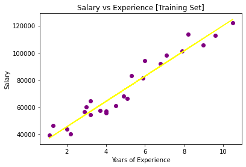
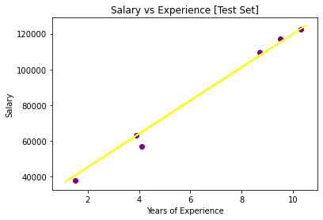
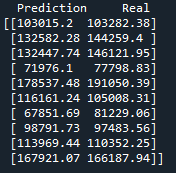
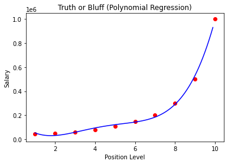
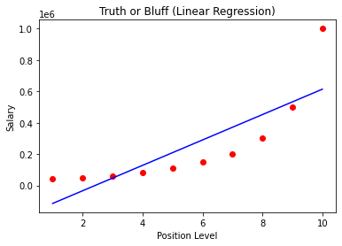
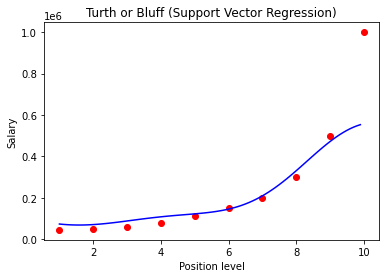
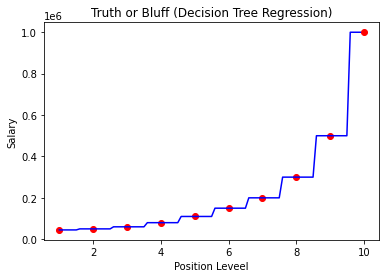
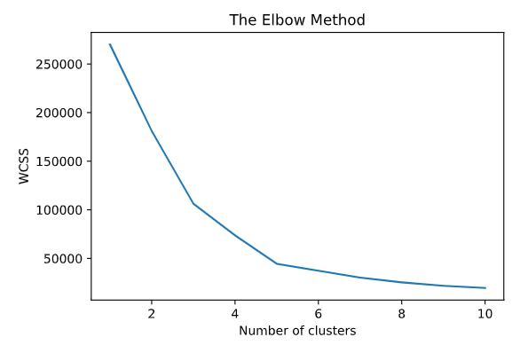
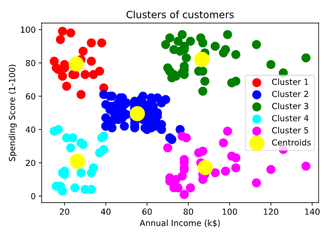

# ML-Learning-Sample
This is the repository that i share that my ML learning sample projects by the following an Course

## [Data  Preprocessing](https://github.com/ebubekirsezer/ML-Learning-Sample/tree/master/Data%20Preprocessing)

# Regressions

## [Simple Linear Regression](https://github.com/ebubekirsezer/ML-Learning-Sample/tree/master/Simple%20Linear%20Regression)

Training Plot          |  Test Plot    
:-------------------------:|:-------------------------:
 | 

## [Multiple Linear Regression](https://github.com/ebubekirsezer/ML-Learning-Sample/tree/master/Multiple%20Linear%20Regression)

## [Polynomial Regression](https://github.com/ebubekirsezer/ML-Learning-Sample/tree/master/Polynomial%20Regression)
Polynomial Regression           |  Linear Regression   
:-------------------------:|:-------------------------:
 | 

## [Support Vector Regression](https://github.com/ebubekirsezer/ML-Learning-Sample/tree/master/Support%20Vector%20Regression)

## [Decision Tree Regression](https://github.com/ebubekirsezer/ML-Learning-Sample/tree/master/Decision%20Tree%20Regression)

## [Random Forest Regression](https://github.com/ebubekirsezer/ML-Learning-Sample/tree/master/Random%20Forest%20Regression)

# Classifications

## [Logistic Regression](https://github.com/ebubekirsezer/ML-Learning-Sample/tree/master/Logistic%20Regression)

## [K-NN](https://github.com/ebubekirsezer/ML-Learning-Sample/tree/master/K-NN%20Regression)

## [Support Vector Machine](https://github.com/ebubekirsezer/ML-Learning-Sample/tree/master/Support%20Vector%20Machine)

## [Kernel Support Vector Machine](https://github.com/ebubekirsezer/ML-Learning-Sample/tree/master/Kernel%20Support%20Vector%20Machine)

## [Naive Bayes](https://github.com/ebubekirsezer/ML-Learning-Sample/tree/master/Naive%20Bayes)

## [Decision Tree Classification](https://github.com/ebubekirsezer/ML-Learning-Sample/tree/master/Decision%20Tree%20Classification)

## [Random Forest Classification](https://github.com/ebubekirsezer/ML-Learning-Sample/tree/master/Random%20Forest%20Classification)

# Clustering

## [K-Means Clustering](https://github.com/ebubekirsezer/ML-Learning-Sample/tree/master/K-Means%20Clustering)

K-Means Elbow          |  K-Means Clustering    
:-------------------------:|:-------------------------:
 | 